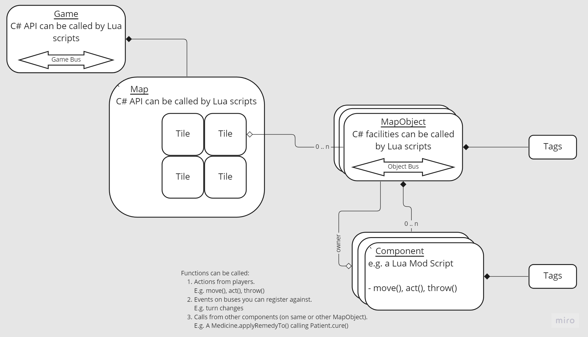

% MultiTurn API
% Mind Feast Games
% Last updated 2023/11/02

# Introduction

This is the (very early) documentation for Lua scripting the MultiTurn platform.  It describes the Lua API and some parts of the YAML level file format.
Obviously it still needs lots of work including more diagrams!

## Overview

MultiTurn is a platform of local game + web-based controllers.  It allows creating grid-based and turn-based games wherein characters perform batches of actions synchronously.

* Grid-based: The game models a 2D grid world that objects exist within and move about on.
* Turn-based: Players enter batches of actions for characters to perform.  The characters perform these actions synchronously.
* Synchronous play: All characters perform their 1'st action, then all characters perform their 2'nd move etc.

The intended style of game for the platform involves multiple players collaborating to coordinate their characters' actions to fulfil a level's goal.
E.g. Alice, Bob and Charlie discuss how to get a patient into a bed and cure them before the patient dies by coordinating picking-up and throwing medicine to each other across a large map.

The architecture implements this as a grid-link [Map] in which multiple [MapObject]s reside, each with multiple [Component]s upon them.

<!--- TODO-20221106: It would be preferable to have the diagram be Mermaid (or at least SVG) and link to the names objects within the doc. --->



## Starting points

Although not specifically part of the API, two sections and one other document are likely useful:

| VITAL SECTIONS                                                                                                                                              |
|-------------------------------------------------------------------------------------------------------------------------------------------------------------|
| The **[Tutorial](#tutorial)** section for beginners.                                                                                                        |
| The **[Modding Tips](#modding-tips)** section for intermediates.                                                                                            |
| The **[Coding how-to's](#coding-how-tos)** section for the advanced.                                                                                        |
| The **[Modder's Guide](https://www.mindfeastgames.com/MultiTurn/Docs/ModdersGuide.html)** for the _rest_ of the documentation (especially the YAML format)! |


## Getting the latest documentation

All the documentation is available from [https://www.mindfeastgames.com/MultiTurn/Docs/](https://www.mindfeastgames.com/MultiTurn/Docs/)

This documentation is built from Markdown file supplied with "MultiTurn: Co OPERATION" in `Co OPERATION_Data/StreamingAssets/CoOperation/Code/Docs`.

The latest HTML version is available at [https://www.MindFeastGames.com/MultiTurn/Docs/API.html](https://www.MindFeastGames.com/MultiTurn/Docs/API.html).

The PDF version is available to download from [https://www.MindFeastGames.com/MultiTurn/Docs/API.pdf](https://www.MindFeastGames.com/MultiTurn/Docs/API.pdf).

Another vital file is the [Modder's Guide](https://www.mindfeastgames.com/MultiTurn/Docs/ModdersGuide.html)

# API Reference TOP

## Standard Lua capabilities made available to scripts

Standard Lua JSON capabilities are provided.  Remember though that it only works on Lua `Table` (not C# references).

Many other Lua capabilities are disabled due to security requirements.

## Functions

Some functions are added to all scripts.

### setAutoAwait()
`setAutoAwait(bool autoAwaitEnabled)`

An advanced option.

Enables or disables auto-await. Enabled (true) by default.

Some methods provided by the platform operate asynchronously meaning that the calling code is suspended while they complete.  When this option is enabled, this is transparent to the calling Lua code.

When disabled, async methods return a Task with an `await()` method upon it which returns the value. If not awaited, the task will run in the background.
When enabled, async methods suspend the script until the task completes and return the value directly.

### setLogDebug()

`setLogDebug(bool logDebug)`
See [DebugLog](#debuglog).

### waitSeconds()

Function to suspend execution of this Mod for the specified number of seconds.  Useful to introduce a pause during a turn.

E.g.
```lua
waitSeconds(1)
```

### waitMilliSeconds()

Function to suspend execution of this Mod for the specified number of milli-seconds.  Useful to introduce a pause during a turn.
Note Milli and Seconds are both capitalised.

E.g.

```lua
waitMilliSeconds(1)
```

## Fields

### Mod data

Data that are provided in the YAML files are merged and provided to the Mod scripts as global variables.

The data are merged into a single set before being applied.

Currently the [thisModData] is used as a base then overlaid with the [allModsData] then overlaid with the [globalData] atop that.

The [globalData] merge is special in that it uses an '[id]' from either of the other two to find its match. The '[id]' is specified is "[id]" at the time of writing.

This strategy allows specifying the 'base' data in `LevelsShared.yaml` with customisations in individual level files and easy Game Designer tweaking via the [globalData] section.

Scripts can also explicitly access [thisModData], [allModsData] and [globalData].

#### Example:

The example shows the full overlay capabilities but can look a bit daunting.

The **best way** to read is to jump down to [Data for `MyAwesomeScript` in grid A2] and look at the values then refer back up to see where values came from.

As an overview, the rest of this example is structured with the 2 input files to start with then 3 YAML chunks showing what data 3 different use cases receive.
Go jump down to [Data for `MyAwesomeScript` in grid A2] now.

##### File 1: `LevelsShared.yaml` specifies the base object

```yaml
objectDefinitions:
  myBaseObject:
    mapObject: Custom
    
    art3d:
    - model: "Art/3D/MyModel.glb"
    
    mods:
    - name: "MyAwesomeScript"
      
      # The thisModData lives within a single Mod script's definition
      data:
        myKey1: "A: value not overridden anywhere comes from thisModData"
        myKey2: "B: value overridden by own allModsData is not present as a global variable"
        myKey3: "C: value overridden by later allModsData is not present as a global variable"
        myKey4: "D: value overridden by globalData is not present as a global variable"
        keyShowingValueCanBeNumeric: 5
        42: "Keys can be numeric but why would you want this?!?!"
        subStructure:
          subKey: "You can embed whole object structures in any data section"
          myKey: "won't clash with above since it's under another object"
          
    - name: "MyMod2"
      data:
        myKey1: "value1 only visible to MyMod2"
        myKey2: "value2 only visible to MyMod2"
        
    # The allModsData lives at the 'top level' within the definition
    data:
      # myKey1: not overridden
      myKey2: "E: value in own allModsData overrides value from thisModData"
      # myKey3: not overridden but will in MyLevel1.yaml
      myKey4: "F: value in allModsData is overridden by globalData when 'id' is used"
      anotherKey: "G: These values are available to all mods on this MapObject"
      
    tags:
    - myTag1
    - myTag2
```

##### File 2: `MyLevel1.yaml` overrides base object for this level

```yaml
grid: |
  A1,B1,
  A2,B2

gridObjects:
  A1: [ myBaseObject ]
  B1: [ MyObj1 ]
  A2: [ { id: MyObj1, data: { id: Special1 } } ]
  B2: [ f ]

objectDefinitions:
  MyObj1:
    # Specify the base from above LevelsShared.yaml
    id: myBaseObject
    # Override some values via the allModsData
    data:
      myKey3: "H: value from level-specific allModsData overrides values from LevelsShared.yaml"

globalData:
  # Key "Special1" is matched from 'id' in A2 above
  Special1:
    # Let's override for this specific instance
    myKey4: "I: value from globalData, matched by 'id' rules them all!"
    otherKeyFromGlobalData: 3.14
```

##### Resultant data provided to `MyAwesomeScript` for the various grid tiles

###### Data for `MyAwesomeScript` in grid A1

```yaml
myKey1: "A: value not overridden anywhere comes from thisModData"
myKey2: "E: value in own allModsData overrides value from thisModData"
myKey3: "C: value overridden by later allModsData is not present as a global variable"
myKey4: "F: value in allModsData is overridden by globalData when 'id' is used"
keyShowingValueCanBeNumeric: 5
42: "Keys can be numeric but why would you want this?!?!"
subStructure:
  subKey: "You can embed whole object structures in any data section"
  myKey: "won't clash with above since it's under another object"
anotherKey: "G: These values are available to all mods on this MapObject"
```

###### Data for `MyAwesomeScript` in grid B1

```yaml
myKey1: "A: value not overridden anywhere comes from thisModData"
myKey2: "E: value in own allModsData overrides value from thisModData"
myKey3: "H: value from level-specific allModsData overrides values from LevelsShared.yaml"
myKey4: "F: value in allModsData is overridden by globalData when 'id' is used"
keyShowingValueCanBeNumeric: 5
42: "Keys can be numeric but why would you want this?!?!"
subStructure:
  subKey: "You can embed whole object structures in any data section"
  myKey: "won't clash with above since it's under another object"
anotherKey: "G: These values are available to all mods on this MapObject"
```

###### Data for `MyAwesomeScript` in grid A2

```yaml
myKey1: "A: value not overridden anywhere comes from thisModData"
myKey2: "E: value in own allModsData overrides value from thisModData"
myKey3: "H: value from level-specific allModsData overrides values from LevelsShared.yaml"
myKey4: "I: value from globalData, matched by 'id' rules them all!"
keyShowingValueCanBeNumeric: 5
42: "Keys can be numeric but why would you want this?!?!"
subStructure:
  subKey: "You can embed whole object structures in any data section"
  myKey: "won't clash with above since it's under another object"
anotherKey: "G: These values are available to all mods on this MapObject"
otherKeyFromGlobalData: 3.14
```

### gameObject

Undecided API.  May be removed.
Only defined when there is a 'View' within the game = not always true.
We prefer to keep 'View' logic out of scripts.

### name

Name of the script (as best determined).

### packageIdentifier

Name of the owning package.

### owner

The 'owner' of this Lua script.
A mobile (non-static) [MapMobile] or a immobile (static) [MapObject].

### tags

Access the [Tags] *on the [ModComponent]*.
Note there are also [tags](#mapobject.tags) on the [MapObject].

### thisModData

Explicit access to data that were provided solely to this Mod script.

### allModsData

Explicit access to data that were provided to all Mod scripts on the same [MapObject].

### globalData

Explicit access to data that were provided in the YAML `globalData` section.

### id

Not to be confused with the [MapObject.id](#mapobject.id) which is used for finding things via the [Entities](#facility.entities) facility.

This is actually user-provided but super-common since it's a special variable.
It's used in the Level file format to look-up override values from [globalData].
See [Mod data].

# LoadFacility

### LoadFacility(string facilityName)

Loads a facility for the script.  Similar to Lua `require()`.

## Facility.Movement

All only work when the owner is movable (not static).

### move(string direction)

Move in [Direction] specified.
Only works when the owner is movable (not static).

See also: [MapMobile.move1SpaceIfPossible](#mapmobile.move1spaceifpossible)

### repositionTo(Vector2Int position)

Reposition to the specified location.
Only works when the owner is movable (not static).

See also: [MapMobile.repositionTo](#mapmobile.repositionto)

## Facility.Action

### doAction()

Co OPERATION special for:

1. pick-up from neighbouring tile if not holding anything
2. otherwise apply the held thing to a neighbouring tile.

## Facility.Throw

### throw(string direction)

Throw in [Direction] specified by the parameter.

## Facility.Entities

### getBusById(number id)

Gets a message bus for a given 'id'.  Exceptions if not available.

### getModById(number id)

Get a mod by its 'id'.  Exceptions if not available.

### getComponentById(number id)

Get a [Component] by its 'id'. Exceptions if not available (invalid id or not accessible to Lua).

### getMapObjectById(number id)

Get a [MapObject] by its 'id'. Exceptions if not available (invalid id).

## Facility.Game

Facility to access the GameManager for things like its `bus` including to get turn start etc.

### game

Provides access to the single [GameManager].

## Facility.ComponentAccess

### getFirstComponentTyped(string typeName)

Gets a component by type name.  Exceptions if not available.

## Facility.Regex

### Regex

Facility that exposes [C# Regular Expressions](https://learn.microsoft.com/en-us/dotnet/api/system.text.regularexpressions.regex?view=netframework-4.5) into Lua.

Constructor accepts a string pattern and optional [RegexOptions](https://learn.microsoft.com/en-us/dotnet/api/system.text.regularexpressions.regexoptions?view=netframework-4.5) provided in numeric form (e.g. `1` for case insensitivity).

Example:

```lua
local Regex = LoadFacility('Regex')['Regex'] or error('No Regex')
local regex = Regex('(Black|White)', 1) -- create a regex, second arg:1 = case insensitive
local tabby = regex.Replace('The black cat snoozes', 'Tabby') -- replace 'Black' with 'Tabby'
```

## Facility.Vectors

### Vector2Int.__new()

See also [Vector2Int].

Optional Facility since one can equally use a Lua `Table` in place of a [Vector2Int] and it will be converted automatically.

Allows constructing Vector2Int (2 component positions and movements using integers) for doing maths or passing to others.

Example: **(TODO-20221008: To be checked!)**

```lua
local pos1 = Vector2Int.__new(2, 3)
local pos2 = Vector2Int.__new(5, 5)
local delta = pos1 - pos2
print('Move '.. delta)
```

## Facility.Messaging

### bus

A variable which is this MapObject's own <see cref="MessageBus"/> (see below).
Used to message between components on the same MapObject or
for use by other components to message these components.

# Types

## MapMobile

The type of all _movable_ MapObjects.  Extends [MapObject] with facilities to move.
To be clear, this means MapMobile has all its own features *as well as* those in [MapObject].

### MapMobile.move1SpaceIfPossible()

`bool move1SpaceIfPossible(Direction direction)`

Returns whether succeeded.

### MapMobile.repositionTo()

`bool repositionTo(Vector2Int position)`

Returns whether succeeded.

### MapMobile.setFacing()

`setFacing(Direction direction)`

Change the direction that this MapMobile is facing.  Value can be retrieved with [MapObject.facing](#mapobject.facing).

## MapObject

The type of all MapObjects -- although see [MapMobile] for movable ones.

### MapObject.bus

Access from Lua as `owner.bus`.

A [MessageBus] for this [MapObject].  Allows sending messages to all subscribers on the same [MapObject].

### MapObject.facing

The [Direction] that this [MapObject] is facing.
Set with [MapMobile.setFacing](#mapmobile.setfacing) (static objects cannot be rotated).

### MapObject.gridPosition

Access from Lua as `owner.gridPosition`.

The read-only [Vector2Int] position of the [MapObject] on the [Map].

Non-static [MapObject]s are [MapMobile]s and have the [move1SpaceIfPossible](#mapmobile.move1spaceifpossible)

### MapObject.id

Access from Lua as `owner.id`

Not to be confused with the [Lua id field](#id) which is used in the YAML to override values via [globalData].

An Entity id for use with the [Entities](#facility.entities) facility.
Allows quickly looking-up other objects by knowing their id.
Explicitly different to the [instanceId](#mapobject.instanceid)
You almost always want to use the `id` (for referencing), not the `instanceId`.

### MapObject.instanceId

Access from Lua as `owner.instanceId`.

A unique instance id.
Unique across all objects in the whole system.
Explicitly not the same as the [id](#mapobject.id)
This is only useful for spotting whether something has changed.
You almost always want to use the `id` (for referencing), not the `instanceId`.

### MapObject.map

Access to the `Map`.

Example access:

```lua
local patient = owner.map.getFirstTagged(2, 3, 'patient')
```

### MapObject.name

Name of the map object.  Aims to be the top-level name from the level YAML file.

### MapObject.tags

The [Tags] upon this [MapObject].

Example use:

```lua
-- including owner but omit if you have a reference, obviously!
owner.tags.addTag('myCustomTag')
```

#### MapObject.typeName

The name of the type of this [MapObject]. Useful for validating type retrieved.  Either 'MapObject' or 'MapMobile'. Experimental (may be removed).

### MapObject.callFunc()

See also [callAction()](#mapobject.callaction) for version with no expected return.

Forms:

1. `object? callFunc(string funcName, ... object[] args)`
2. `object? callFunc(string funcName, [RequireReceiver] requireReceiver, ... object[] args)`

Try to call `funcName` with any supplied arguments on any components (scripts) on the [MapObject].
Somewhat analogous to Unity's `GameObject.SendMessage()` or `GameObject.Broadcast()` but with possibility of return value (which is admittedly handled oddly).
Returns the first non-null/non-void result of the first matching function found.
If functions return null/void, will continue calling others.

### MapObject.callAction()

Same as [callFunc()](#mapobject.callfunc) but has no return value so calls on *every* script.

### MapObject.getFirstNeighbouringObjectTagged()

`IMapObject? getFirstNeighbouringObjectTagged(string tag)`

### MapObject.getNeighbouringObjectsTagged()

`IEnumerable<IMapObject> getNeighbouringObjectsTagged(string tag)`

### MapObject.getFirstFacingObjectTagged()

`IMapObject? getFirstFacingObjectTagged(string tag)`

Gets the first MapObject with the given tag in the adjacent tile in the direction that this object is facing. Returns null if none are found.

### MapObject.getFacingObjectsTagged()

`IEnumerable<IMapObject> getFacingObjectsTagged(string tag)`

Gets all MapObjects with the given tag in the adjacent tile in the direction that this object is facing.

### MapObject.getComponentsTagged()

`IEnumerable<IComponent> getComponentsTagged(string tag, SearchType searchType = SearchType.SelfAndChildren)`

### MapObject.getFirstComponentTagged()

`IComponent? getFirstComponentTagged(string tag, SearchType searchType = SearchType.SelfAndChildren)`

### MapObject.destroyObject()

`void destroyObject()`

Results in a [state.MapObject] message being sent to the object's bus with value `Destroyed`.

### Messages:

#### siblingAdded

Sent on a [MapObject's bus](#mapobject.bus) when an object is added to the same tile.
The associated value is the `id` of the object added.

#### siblingRemoved

Sent on a [MapObject's bus](#mapobject.bus) when an object is removed from the same tile.
The associated value is the `id` of the object removed.

#### state.MapObject

Sent when state changes.  Possible values are currently:

| Name          | Seen by Lua | Description                            |
|---------------|-------------|----------------------------------------|
| NotYetStarted | No          | When Lua has not yet been initialised. |
| Started       | No          | When Lua is started.                   |
| Destroyed     | Yes         | When `MapObject` is destroyed.         |

#### level.won

Sent by a Lua script when a level is won.
Triggers moving to the next level.

#### level.lost

Sent by a Lua script when a level is lost.
Triggers restarting the same level.

## CoOpActor

This is a 'native' (C#, not Lua) component present on players in early versions.
It may be discontinued in later versions as more of its capabilities are moved to Lua.

Example:

```lua
print('Acting by getting actor from owner', owner)
local coOpActor = owner.getFirstComponentTagged('CoOpActor', SearchType.SelfOnly)
print('Acting with actor', coOpActor)
-- return success at either carrying or applying to neighbour (placing patient in bed)
local result = coOpActor.carryOrApplyToNeighbour(actDirection)
print('Result of acting with actor', result)
```

### id

The id of this Component.

### carryOrApplyToNeighbour()

**DEPRECATED!  Use Lua to carry instead.**  (See current CoOpActMod for example.)

`bool carryOrApplyToNeighbour(Direction direction)`

If nothing held, attempts to carry 1 item from the direction specified.
If already carrying, tries to apply the item in the direction specified.
This can result in placing items down or actually applying them (e.g. giving remedy to patient).
Returns a boolean indicating success.

### throwInDirection()

`bool throwInDirection(Direction direction)`

When not carrying, does nothing.
When carrying, attempts to throw the carried item in the specified direction.
Returns boolean indicating success.  (Throwing can fail if there is no space to throw into.)

## Carrier

Example:

```lua
local carrier = owner.getFirstComponentTagged('carrier');
assert(nil ~= carrier, 'Player lacks carrier component')
print('Lua isCarrying:', carrier.isCarrying)
```

### isCarrying

`bool isCarrying`

Whether presently carrying anything.

### Carrier.canCarry()

`bool canCarry(Carryable carryable)`

Whether a request to carry the specified carryable would succeed.

### Carrier.carry()

`bool carry(Carryable component)`

Ask the carrier to carry the specified carryable and return success.

### getCurrentlyCarried()

`ICarryable? getCurrentlyCarried()`

Get the thing currently carried.

### endCarryInto()

`bool endCarryInto(IAcceptor acceptor)`

Attempt to end carrying by placing the carried item into an [Acceptor] (see that for example).

### endCarry()

`bool endCarry(Vector2Int position)`

Attempt to cease carrying by placing down the item in the direction specified.

## Carryable

A component which allows carrying the owning MapObject.

### Carryable.isAvailableToBeCarried

`bool isAvailableToBeCarried`

Whether the Carryable is available to be carried (e.g. not already being carried).

## Acceptor

Example:

```lua
local function endIntoAcceptorMapObject(carrier, acceptorMapObject)
    local acceptor = acceptorMapObject.getFirstComponentTagged('acceptor')
    return carrier.endCarryInto(acceptor)
end
```

## Map

The grid-like level map.
Actually a C# class called `MapProxy`.

### Map.getAllObjectsTagged()

`getAllObjectsTagged(string tag)`

Gets all objects from the whole map that are tagged with `tag`.  Returns a Lua `Iterator` of [MapObject]s.

### Map.getFirstObjectTagged()

`getFirstObjectTagged(string tag)`

Gets first [MapObject] from the whole map that is tagged with `tag`.

### Map.getFirstNeighbouringObjectTagged()

`getFirstNeighbouringObjectTagged(Vector2Int pos, string tag, Direction facingToPrioritise = Direction.North)`

### Map.getFirstTagged()

* `getFirstTagged(int x, int y, string tag)`
* `getFirstTagged(Vector2Int pos, string tag)`

Gets the first correctly tagged component (Lua script) at the specified position.

### Map.getAllTagged()

* `getAllTagged(int x, int y, string tag)`
* `getAllTagged(Vector2Int pos, string tag)`

Gets a Lua `Iterator` of all correctly tagged component (Lua script) at the specified position.

### Map.getSummary()

`map.getSummary()`

Gets a string summary of the Map.

Actually the debug representation the developers use to see what The Model is (as opposed to what's shown in the game, known as The View).

**WARNING**: Format may change without notice.

### Map.isValidMapPos()

Return whether the specified position is a valid location on the [Map].

* `bool isValidMapPos(Vector2Int pos)`
* `bool isValidMapPos(int x, int y)`

### Map.getAllAt()

Gets a Lua 'Iterator' of all [MapObject]s at the specified position.

* `getAllAt(Vector2Int pos)`
* `getAllAt(int x, int y)`

See also [Map-like access](#map-like-access).

### Map-like access

Returns a Lua 'Iterator' of all [MapObject]s in the specified position.

`map[x, y]`

See also [Map.getAllAt()](#map.getallat).

### TODO: **TODO: Vector access** **TODO: Table access**

## GameManager

Manages the flow of the game.

### GameManager.bus

A [MessageBus] on the GameManager.
Used for sending and receiving game-wide messages.

Access as:

```lua
-- Bring in the ability to subscribe to the GameManager's message bus for game phase changes
LoadFacility('Game')

local function onGamePhaseChanged(message)
  print('Got game phase:', message, 'JSON:', json.serialize(message))
  local phase = message.data.gamePhase;
  print('Game phase: "'.. phase ..'"') -- will be "planning", "acting" or "finished"
  game.bus.send({'myMessage'})
end

-- subscribe to get informed when game rounds start
game.bus.subscribe('gamePhase', onGamePhaseChanged)
```

### GameManager.loader

Access to the [Loader] to instantiate objects (defined in level file's `objectDefinitions` section) at runtime.

### GameManager.map

Access to the [Map] currently running (same as `owner.map`).

### GameManager.saveData

Access to the game's [SaveData].

### Messages:

#### gamePhase

Possible values:

* `planning` : When players are entering actions.
* `acting` : When players' avatars are enacting the moves entered.
* `management` :  When players are voting for item placement.
* `managementResults` : When results of the choices made in the management phase are being displayed.
* `finished` : When a level is finished.

#### turnStart

Provisional message that indicates the start of a turn.

##### turnNumber

Payload of [turnStart] message indicating the turn number.

Indexed from 1 for Lua convenience.

E.g. 1, 2, 3, 4 for the 4 action slots.

#### viewMode

Message sent to indicate what sort of view is running.

##### default3D

Usual 3D version 1 view.

##### none

No view present (e.g. when running on headless server or in unit test).
Used internally to expedite test completion by skipping purely cosmetic delays in gameplay (e.g. `DelayPerTurn.lua`).

## Loader

### Loader.hasObject()

`bool hasObject(string objectDefinitionName)`

Whether the specified object definition exists.

### Loader.instantiate()

`IMapObject? instantiate(string objectDefinitionName, Vector2Int position)`

Instantiate an object defined in the Level Map's `objectDefinitions` section at the specified position (or nil on failure).

## SaveData

Stores data for a package.
Meaning it will be stored on the Game persistently for use within this and future runs of the game.
N.b. Until [save()](#savedata.save) is called, quitting the game could lose values.

#### SaveData.getNumber()

Get the number stored against this `saveName`.

`float getNumber(string key)`

### SaveData.setNumber()

Store the `data` against the `key`.

`void setNumber(string key, float data)`

#### SaveData.getString()

Get the number stored against this `saveName`.

`float getNumber(string key)`

### SaveData.setString()

Store the `data` against the `key`.

`void setNumber(string key, float data)`

### SaveData.save()

Persist the values to permanent storage.  Until this is called, game quit could lose values.

`void save()`

## Message

A Message sent on a [MessageBus].

Friendly name: `message`

There is an auto-converter from Lua `Table` which is the simplest way to define messages from the Lua side.

Messages have 2 top-level members:

* `metadata` : A set of values which may be empty.
* `data` : A map of key-value pairs which may be empty.

Note: an empty message is **not** valid!

### Example simple Lua message (one metadata):

```lua
bus.send({'notification'})
```

### Example simple Lua message (one datum):

```lua
bus.send({myKey = "myValue"})
```

### Example complex JSON message:

```lua
local message = {
  metadata = { "2022/10/11", "oftenBlank" },
  data = {
    senderId = "GameManager",
    gamePhase = "acting"
  }
}

bus.send(message)
```

Or use the JSON facility to build from JSON:

```json
{
  "metadata": [
    "2022/10/11",
    "oftenBlank"
  ],
  "data": {
    "senderId": "GameManager",
    "gamePhase": "acting"
  }
}
```

Subscription will be checked against all of the values in `metadata` and the `data`'s _**top-level keys**_ (not the values, not sub-keys).
So to receive the message above, one could [subscribe()](#messagebus.subscribe) to `2022/10/11`, `oftenBlank`, `senderId` or `gamePhase`.

## MessageBus

The bus type upon which [Message]s can be sent.
Message subscriptions are case **insensitive**.
Actually a C# type called `MessageBusModProxy`.
There are more than one bus.  There's one for the whole game on the [GameManager](#gamemanager.bus) a separate one on each [MapObject](#mapobject.bus).

Friendly name: `MessageBus`

### MessageBus.subscribe()

A function that takes a string topic and callback to use when messages relating to that topic appear.
The callback will be passed a single argument of the [Message].
The topic is matched against any of the `metadata` values or `data` keys (see [Message]).
Return should be one of:

1. Nothing.  Just drop out of the bottom of the function.
2. Explicitly nothing.  Use `return` without any value to return `void`.
3. Explicit `nil`.  If that naked return makes you nervous, return `nil`.
4. A [Message].  This will be delivered to any [response callback](#with-response-callback-sendmessage-responsecallback)s provided in the [`send()`](#with-response-callback-sendmessage-responsecallback) call.

Simplest example:

```lua
local function callback(message)
  print('Got a message about that topic:', message)
end

bus.subscribe("a topic", callback)
```

More complete example:

```lua
local function callback(message)
  print('Got a message about that topic:', message)
  
  if message.data.rsvp then
    return { success = true } -- return a message to send to any response listeners
  elseif message.metadata.nil_return then
    return -- returning nothing (void) or explicit `nil` both fine.
  end
  -- dropping out of the bottom of the function (void return) also fine.
end

bus.subscribe("a topic", callback)
```

### MessageBus.send()

A function to send [Message]s on a [MessageBus] (see below).

Please see [Message] the many formats and facilities a Message can have.  The examples below use the simplest message to focus on the sending API!

There are several 'overloads' (different ways of calling the same function).

#### Simple: `send(message)`

Fails if there is no listener.

```lua
bus.send({'myMessage'})
```

#### Optional listener: `send(message, false)`

Does not fail if there are no listeners.

```lua
bus.send({'myMessage'}, false)
```

#### With response callback: `send(message, responseCallback)`

Get a callback from any subscribers that send one.  Might be called more than once.
Fails if there is no listener.

```lua
local function myCallback(response)
  print('Got another response from a listener:', response)
end

bus.send({'myMessage'}, myCallback)
```

##### Tip: Response must be a message

N.b. `response` **MUST** be an object, i.e. a message.  So in a listener, rather than:

```lua
local function callbackThatReturnsINCORRECTLY(message)
    print('Got a message about that topic:', message)
    -- THE FOLLOWING IS AN ERROR because it is not a message!
    return 'STRING IS NOT A VALID MESSAGE SO WILL NOT BE DELIVERED TO RESPONSE LISTENER!'
end

bus.subscribe("a topic", callback)
```

One should instead do:

```lua
local function callbackThatReturnsCorrectly(message)
    print('Got a message about that topic:', message)
    -- The following is fine -- it's a message
    return { 'as an object, this will be delivered successfully!' }
end

bus.subscribe("a topic", callback)
```

##### Tip: To call a regular function with a values from a message, use Lua's `unpack()`

```lua
--- func to call from listener
function myFunc(arg1, arg2)
    print('arg1:', arg1, 'arg2:', arg2) -- arg1 will be 1, arg2 will be 'two'.
    return 'My result'
end

--- listener
function messageListener(message)
    local data = message.data
	local response = myFunc(unpack(message.data.args)) -- spreads args over all parameters
    return { response }
end

--- response receiver
local function responseReceiver(response)
	print('response to send:', json.serialize(response)) -- i.e. expect called once with `{ 'My result' }`
end

--- send message
local sendResult = interactableMapObject.bus.send({ action = 'interact', args = { 1, 'two' } }, responseReceiver)
```

#### Optional listener and with response callback: `send(message, responseCallback, false)`

Get a callback from any subscribers that send one.  Might be called more than once.
Does not fail if there are no listeners.

```lua
local function myCallback(response)
  print('Got another response from a listener:', response)
end

bus.send({'myMessage'}, myCallback, false)
```

## Mod

A Lua script.
Actually a C# type called `ModProxy`.

Friendly name: `mod`

## ProgressBar

### ProgressBar.setMaxValue()

`void setMaxValue(float newValue, bool setCurrentValueToMax)`

Set the maximum value of the progress bar.

### ProgressBar.setValue()

`void setValue(float newValue)`

Set the current value of the progress bar.  It will display as a proportion of the maximum value.

## Tags

A Set of strings used to identify and distinguish [MapObject]s and [Component]s.

### Tags.count

A count of the number of tags.

### Tags.tags

A Lua 'Iterator' of all tag values (strings).

Example:

```lua
local allTagsOnSelfIterator = owner.tags.tags
local firstTag = allTagsOnSelfIterator()
print('First tag:' .. firstTag)
```

### Tags.hasTag()

Returns whether the target has the specified tag.

Example:

```lua
print('Am I a patient:', owner.tags.hasTag('patient'))
```

### Tags.addTag()

Add a tag if it's not already present (does nothing otherwise).

Example:

```lua
owner.tags.addTag('markedForFutureReference')
```

### Tags.removeTag()

Remove a tag if it exists (does nothing otherwise).

Example:

```lua
owner.tags.removeTag('markedForFutureReference')
```

## Vector2Int

Friendly name: `pos`

Positions and movements within the [Map] are represented as an x,y vector of this type.  Note that these are integers -- not floating point numbers (e.g. `-3`, `0` and `42` not `3.14` nor `-0.1`).

Generally you should use a Lua `Table` in place of a Vector2Int and it will be converted automatically.
E.g. `{ 2, 3 }`

There is also a [Vector2Int Facility](#facility.vectors) that allows constructing new [Vector2Int] for doing maths or passing to others.

## Component types

### Component

[MapObject]s can have either or both Lua/Mod [ModComponent]s and/or native (C#) Components.

A component on an owning MapObject which provides some functionality. Can be a Lua script (ModComponent) or a C# component (such as Carrier).

#### Component.owner

The [MapObject] this [Component] is upon.

#### Component.tags

Tags on the [Component] (as distinct from those on its owner, the [MapObject]).

#### Component.typeName

The name of the type of this component. Useful for validating type retrieved.

#### ModComponent 

All Lua (mod) scripts you write and those supplied by Mind Feast Games.
Access their members (non-local methods and fields) via "array notation" as described in [Invoke code on one object from another].

##### How to add tags to component?

Has its own `tags` (not to be confused with `owner.tags` which is on the [MapObject]).

#### Native components

##### PlayerDoctor

A 'native' (C#) component player type used in Co OPERATION.

## Enumerations

### Direction

Enumeration

* North = 0,
  Grid ( 0, -1)
* East = 1,
  Grid ( 1, 0)
* South = 2,
  Grid ( 0, 1)
* West = 3,
  Grid (-1, 0)

### RequireReceiver

* DoNotRequireReceiver
* RequireAtMostOneReceiver
* RequireOneOrMoreReceivers

# Special data


## DebugLog

Define this as true (in mod data -- before starting script!) to have instructions logged as they're executed.
An extreme form of debugging!

This can also be turned on and off within a script / from another script via [`setLogDebug(bool)`](#setlogdebug).  This is especially useful for debugging specific sections of Lua code.

## instructionLimit

To prevent runaway Lua scripts hanging the game or degrading performance,
they are limited to an arbitrary number of instructions (1000 at time of writing).

Define this variable to change the number that can be executed in a single call.

You will know if this is needed when you see messages of the form
"InstructionsExceededException: Ran for more than 1000 instructions so stopped".

# Modding Tips

## Lua type information

Although Lua doesn't have static types, there exist IDE plugins to provide this facility.
We provide `CoOpTypes.lua` and `ModGlobals.lua` to allow autocompletion and static analysis.

For Rider, we recommend "[Luanalysis](https://github.com/Benjamin-Dobell/IntelliJ-Luanalysis)".  Pro-tip: If it does not seem to be working, right-click `CoOpTypes.lua`, select "Tools | Start Index".  Repeat for other files.
_(If sufficient demand, we might be able to create and provide a utility to update the `.index/.idea.<PROJECT_NAME>/indexLayout.xml` with appropriate files.  Let us know.)_

For other IDEs Google for "EmmyLua".

## LevelDesign screen

The LevelDesign screen allows both designing maps _and_ working on Lua logic.

Facilities available here are:

* [Start scripts]
* Use [keyboard controls] to mock actions from the phone controllers.
* Use the [Lua console] to check logging output and/or errors.
* Interactively explore the API or send messages using the [REPL].
* Update the scripts and YAML and reload (and remember to re-start the scripts!)

### Start scripts

By default, the [LevelDesign screen] does not start any scripts in your level.  Press this to start the scripts.  This is also required to use the [keyboard controls].

### Keyboard controls

Use `F5` or `control-R` to reload the level.  This done automatically when the system detects the main level file has changed but it does not yet detect when script files or YAML files included by the main level file are modified.

Each of the player characters have a set of keyboard controls which can be used once you have [Start scripts].  The "throw modifier" should be held then a direction pressed to throw in that direction.

|                                 | Move                  | Act           | Throw modifier |
|---------------------------------|-----------------------|---------------|----------------|
| P1: Athlete "Tamira"            | Up, Left, Down, Right | Right-control | Right-shift    |
| P2: American footballer "Jason" | W, A, S, D            | Left-control  | Left-shift     |
| P3: Clown "Ethan"               | I, J, K, L            | U             | O              |
| P4: Chef "Prisha"               | T, F, G, H            | R             | Y              |

### Lua console

Access the Lua console via the Escape key (and dismiss again, using same).
It will also automatically appear when an error occurs.

### REPL

Below the [Lua console] is a text entry field for entering Lua interactively via a [REPL](https://en.wikipedia.org/wiki/Read%E2%80%93eval%E2%80%93print_loop) (also called a Lua shell).

Press Enter execute and Shift-Enter for a newline.

History is persisted and accessible via alt-up/down.

Some convenience fields are made available.
You can, of course, check whether this documentation is up to date by checking for yourself with:

```lua
for k,v in pairs(_G) do print(k, ":", v) end
```

However the main ones are:

#### REPL.game

Access the [Game].

#### REPL.map

Access the [Map].

## Phone controller keyboard shortcuts

Testing your new level and/or scripts in the 'live game' with phone controllers can be quite onerous.  One thing that can help is opening the controller webpage in a desktop browser sized adequately small to overlay the game, adding all players to that single controller then using the keyboard shortcuts for move entry.

Keyboard shortcuts:

- 1-4 for slot selection,
- WASD for movement,
- shift-WASD for throw,
- Space-bar for 'act',
- Return for 'Ready'.

# Tutorial

Big parts

1. [1. Acquire game](#1-acquire-game)
2. [2. Prepare package](#2-prepare-package)
3. [3. Edit level](#3-edit-level)
4. [4. Edit art](#4-edit-art)
5. [5. Edit logic (code)](#5-edit-logic)
6. ...
7. Profit?

## 1. Acquire game

1. We recommend using the Itch App (rather than downloading directly off the Itch website).  That will ensure your version of the game is up-to-date. \
   [https://itch.io/app](https://itch.io/app)
2. Start the app and login.
3. Add the game via the app's address bar: \
   https://mind-feast-games.itch.io/cooperation
4. Download.
5. Once downloaded, run once to ensure all set.
6. Exit the game

## 2. Prepare package

We supply a template package to work from however the official game levels (and logic etc) are provided right next to that so you can always check it to see how we did something.  The official files may be overwritten by updates.

**The template package may also be overwritten so we recommend duplicating into a new directory when you start work!**

1. Find the install location \
   Either:
   1. Open it if you already know it or
   2. In the Itch app, go to your "Library"
   3. Right click the game's image
   4. Select "Open folder in Explorer"
2. Navigate to the "`StreamingAssets`" directory.  It should be: \
   "`Co OPERATION_Data/StreamingAssets`"
3. Note the 'official game' files are in the sub-directory you can see "`CoOperation" and you're very welcome to investigate how we've done something.  That's probably one of the best sources of answers.  We don't claim the way we've done it is the _best_ way nor that those answers will stay the same as we continue to develop the game! :-O 
4. Navigate into the "`PlayerPackages`" directory and note the "`MakeYourOwnWithThisTemplate`"
5. Duplicate the "`MakeYourOwnWithThisTemplate`" to whatever you wish to call your new package.  E.g. "`UseTheSameName-WhatCouldGoWrong`" ;-P
6. Enter the directory
7. Edit the "`package.yaml`" and update the "`packageName`" and accompanying fields with your package name, description etc.
8. For the rest of the structure of this file, consult the [Modder's Guide](https://www.mindfeastgames.com/MultiTurn/Docs/ModdersGuide.html)
9. Feel free to explore the rest of this directory structure.  Hopefully it's reasonably self-explanatory (but that's what the rest of this doc is all about!)
10. Restart the game
11. You now have the choice of playing your scintillating new package (which is a 'lite' version of the official game) or improving upon it!
    1. To play, join controllers as usual and select the new package that appears.  Better, though...
    2. Top-right corner of the Join Screen is the "Level Design" button.  Press it!
12. Within the Level Design screen, the big field at the top is the level filename under "`StreamingAssets`"
13. Enter the full path to a level file in here.  For example, if your package were called "`MakeYourOwnWithThisTemplate`", you would enter:
    `PlayerPackages/MakeYourOwnWithThisTemplate/Levels/Level_1_players_2.yaml`

## 3. Edit level

### 3A. Get to know the Level Design UI

Once you have a level open, hover over the toolbar buttons to get tool-tips explaining their function.

At the time of writing, the buttons are:

* "scroll" : Start scripts and open the modder side-bar.
* "sun" : "Toggle game visuals" to show the players, lights, ground, etc.
* "camera" : "Toggle camera" to rotate the view from overhead (similar to the map file) and in-game.
* "speaker" : "Level sounds" to edit sounds
* "Painting" : "Generate thumbnail"
* "Ladder" : "Options" to quit etc.

For working on a level's design, the most useful to start are probably the "sun" and the "camera" and, once you wish to test the gameplay, the "scroll".

### 3B. Actually edit

Let's make a change to the level file and see the effect.

You'll need a text editor to edit the files.  We recommend something that knows how to highlight YAML -- the format that the level file uses.  Most of these also highlight Lua -- the format the code uses.

Potentials:

* For regular users:
  * [Sublime](https://www.sublimetext.com/)
  * [Notepad++](https://notepad-plus-plus.org/)
* For coders:
  * [Rider](https://www.jetbrains.com/rider/) (or other JetBrains IDE)
  * [Visual Studio](https://visualstudio.microsoft.com/) / Visual Studio [Code](https://code.visualstudio.com/)
* For UNIX admins ;-)
  * [VIM](https://www.vim.org/)

1. Open the same level file in your preferred code/text editor.  
2. The "`Level_1_players_1.yaml`" has lots of comments in it. \
   If you'd prefer something more streamlined to make the structure easier, choose any of the other level files. \
   To reiterate, the structure of this file is explained in the [Modder's Guide](https://www.mindfeastgames.com/MultiTurn/Docs/ModdersGuide.html)
3. Let's move something -- we'll move the bed over a square to get you started.
4. Navigate down to the `gridObjects` section and (around line 74) you should see a line with "`b_s`" in it -- probably for map cell "`A1`"
5. Cut it from its current position and paste it on another line (one with just an `f`), perhaps line `B1`.
6. Switch back to the game and you should find the bed has moved positions.

While it's very convenient to use definitions directly in the level file you're working on, it's usually better to place them in a file shared between (included into) all level files.  You proably want to move your new definition into "`LevelsShared.yaml`" for other levels to use!  One thing to note, when you edit the top-level Level file, the Level Design screen automatically detects and reloads the level.  It does not monitor any included files -- neither other YMAL nor Lua files.

### 3B. Play the level in Editor

Of course, you can exit the Level Design screen and play the game with friends but that's a long iteration cycle.  Better to test in-Editor.

Press the "scroll" button to start scripts.  Any problems will cause the Lua console to pop up.  Assuming everything went OK, you can now use the built-in keyboard controls to control the player characters.  Be aware, at the time of writing, it's best to wait between keypresses for the animations to complete.  The 'View' can get unsynchronised with the 'Model' otherwise and it's very hard to understand what's happening!  _(It's on our list of things to fix!)_

The game cycles between 2 states:

* "Planning" when the players are entering moves and
* "Acting" when the game is enacting those moves.

To prompt actions that occur at the start of one of those phases (such as patients losing health or arriving), press the "Next phase" button.  (More on this in [5. Edit logic](#5-edit-logic).)

## 4. Edit art

### 4A. Edit 3D art

As explained in the [Modder's Guide](https://www.mindfeastgames.com/MultiTurn/Docs/ModdersGuide.html), almost all 3D art is GLB files.  This is a neat format since it includes everything -- mesh, textures etc.

Make your own with the awesome and free [Blender](https://www.blender.org/) or the less free [Maya](https://www.autodesk.com/products/maya/overview) or, for the less artistically inclined, download some off the Internet!  Sites like [Sketchfab](https://sketchfab.com/) have many free models to get started with.

1. Selecting "[Downloadable](https://sketchfab.com/3d-models?date=week&features=downloadable&sort_by=-likeCount)" shows us things we can download for free (but remember to check the licenses)!
2. I paged down a bit to find a simple prop -- some [farm sacks](https://sketchfab.com/3d-models/farm-sacks-b640b4ca8e284ebb85aaf78c1e833932)
3. Log in to download
4. Select "Download 3D Model"
5. Near the bottom, you'll see "GLB".
6. Choose a low-resolution version (we _are_ a game after all and the textures are only ever seen at range -- better to be kind to player's power and planet!)
7. Download into the "`Art/3D`" directory (I ended up with a file called "`farm_sacks.glb`")
8. Return to the level file YAML
9. Navigate down to the `objectDefinitions` section and we'll swap the sphere for our new model.
10. I replaced `Sphere.glb` with `farm_sacks.glb`
11. Save the file, switch back to the game and you should see your new model in-game.
12. Likely the model will be incorrectly positioned, rotated or scaled but you can see the fields to edit and check the Modder's Guide for syntax.
13. While it's very convenient to use definitions directly in the level file you're working on, it's usually better to place them in a file shared between (included into) all level files.  You proably want to move your new definition into "`LevelsShared.yaml`" for other levels to use!

### 4B. Edit 2D art

TODO!  Check the "CoOperation" package (for how we use 2D art) and the [Modder's Guide](https://www.mindfeastgames.com/MultiTurn/Docs/ModdersGuide.html) for options.

## 5. Edit logic

Hopefully you've previously started scripts and moved one of the players into the 'powerup' object and seen it disappear.
That's implemented by a Lua script in the "`Code/Templates`" directory called "`DestroyOwnerWhenPlayerEntersSquare.lua`".  Let's change it to move to a different square instead of destroying itself.

1. Let's have a quick look in the Lua console to familiarise
   1. press "Escape" or use the GUI to open the console
   2. You can see the player characters' scripts are all set "`DebugLog`" enabled so report their line numbers are snippets as they execute. \
      This was done for demonstration purposes and you can disable those if you find them too intrusive.  Of course, you'll probably want to enable it for your scripts in the hopefully impossible event of you having a bug (don't worry, no coder _doesn't_ write bugs ;-) ).
   3. As hinted in the REPL console, you can enter multiple lines of code to try things out and use Alt-Up/Down for history.  This is persisted between runs.
   4. Let's cause a game phase change by issuing one from the console.  Enter the following, one to a line:
      ```lua
      acting = { gamePhase = 'acting' }
      planning = { gamePhase = 'planning' }
      game.bus.send(acting)
      -- (perhaps press Alt-Up to get that last line back to prove history works)
      game.bus.send(planning)
      ```
      This defines 2 variables "`acting`" and "`planning`" then uses the [game.bus](#gamemanagerbus) to send them to all listeners -- including the Bed.
2. Let's supply the new position from the level file to demonstrate data use:
   1. Edit the level file and, in the `objectDefinitions` section, find the reference to the script.
   2. Underneath, add a new entry "`data:`" (with the colon) at the same indentation as the word "`mods`"
   3. Under that, indent another 2 spaces and add "`destination: [ 2, 1 ]`".  Two important notes:
      1. **Zero-indexed**: Positions within the Level Map are 0-indexed positions X then Y so `2, 1` means the third column (3 up from 0), the second row (2 up from 0).
      2. **YAML Array and Mappings vs Lua Array-like Tables and Table**: See table below this list.
      3. **Type conversion**: We try to automatically convert types from YAML to Lua so numbers become numbers (not strings) and `true` becomes the boolean value.
   4. The section should now read:
      ```yaml
       mods:
       - name: DestroyOwnerWhenPlayerEntersSquare
         data:
           destination: [ 2, 1 ]
      ```
      Note the "`data`" could also have been outdented one or accessed via `globalData`.  See [Mod data](#mod-data) for too much detail!
3. Next we'll use that datum in the code
   1. Edit "`DestroyOwnerWhenPlayerEntersSquare.lua`"
   2. Right under the descriptive comment, add a line to ensure `destination` has a value in case it's not defined (good practice):
      ```lua
      destination = destination or { 1, 1 }
      print('Destination:' .. json.serialize(destination))
      ```
   3. Now find the line that destroys the object reading `owner.destroyObject()`
   4. Comment it out (2 hyphens to comment in Lua):
      ```lua
      -- owner.destroyObject()
      ```
      Keep [MapObject.destroyObject()](#mapobjectdestroyobject) around to simplify that next version that jumps then powers-up?
   5. Add our new functionality:
      ```lua
      print('Teleporting to' .. json.serialize(destination))
      owner.repositionTo(destination)
      ```
      This uses the [MapMobile.repositionTo()](#mapmobilerepositionto) to reposition the [owner](#owner) to the destination. \
      There is also [MapMobiles.move1SpaceIfPossible](#mapmobilemove1spaceifpossible) but as of 2022/11/24, only players and some other mobiles use it.  This is a bug that will be fixed in a coming release.
4. Test the change. \
   N.b. When you edit the top-level Level file, the Level Design screen automatically detects and reloads the level.  It does not monitor any included files -- neither other YMAL nor Lua files.  As such, you need to press "Load" again and also press the "scroll" button to start the scripts.
5. If we had problems, we could enable "`DebugLog`"
   1. As noted above, all good programmers write bugs.  Next to your `destination` value, you can add another line to enable our debug helper which prints each line as it executes.  It will then read:
      ```yaml
       mods:
       - name: DestroyOwnerWhenPlayerEntersSquare
         data:
           destination: [ 2, 1 ] # Square brackets -- see table below
           DebugLog: true
      ```
   2. When you reload and re-run the scripts, you should see individual sections of your script being executed.

As referenced above, Lua and YAML differ very slightly in their representation of arrays and objects.  Here's a table to help clarify:

|             | Syntax                   | Notes                                                                                                            |
|-------------|--------------------------|------------------------------------------------------------------------------------------------------------------|
| YAML Array  | `[ 4, "a", 3.14 ]`       | Can also use block syntax and precede with a hyphen for each new entry.                                          |
| YAML Object | `{ a: "value", b: 5 }`   | MUST include a space after the key.  Can use block syntax with indent.                                           |
| Lua Array   | `{ 4, 'a', 3.14 }`       | 1-indexed arrays but actually tables with keys 1 onwards. <br/>  So equivalent to `{ 1 = 4, 2 = 'a', 3 = 3.14 }` |
| Lua Object  | `{ a = "value", b = 5 }` |                                                                                                                  |

This tutorial used YAML to define a Vector2Int as an array since that's most intuitive for Lua use.  So YAML:

```yaml
destination: [ 2, 1 ]
```

was converted to Lua:

```lua
destination = { 2, 1 }
```

Read the rest of this documentation for further information on functions and functionality you can use within your scripts and please feed back to us about anything that could do with clarifying!

Jump back up to the [Table of contents](#TOC) to see which might inspire your next ideas!

# Coding how-to's

## Invoke code on one object from another

For example, from the player script that gets invoked when the player presses "interact", how to run some code on an object in the square in-front of you?

There are (at this writing) 5 ways to do this.
~~_**but**_ probably only the first 3 are useful, depending on your circumstance/preferences.~~

At the time of writing, (5) is safer than (1) and (2) since they _can_ cause an `ArgumentOutOfRangeException` (see [#FAQ]). In time, we aim to make them as safe.
Once done, (1) will be the simplest but most 'shotgun', (2) will be _slightly_ more complex but better targeted and (3) will be best decoupled.  The last two are (4) a tweak to (3) and (5) included for completeness (in case someone needs to know)!

1. [Direct call via MapObject properties.](#directly-invoke-code-via-mapobject-properties-array)
   e.g. `interactableMapObject['interact'](args)`
2. [Direct call on a component (script)](#direct-call-on-a-component-script).
   Useful if you have more than one component with the same method name!
   e.g. `interactableMapObject.getFirstComponentTagged('myComponentTag')['interact'](args)`
3. [Messaging via MapObject bus](#messaging-via-a-bus).
   e.g. `interactableMapObject.bus.send({action = 'interact', args = args})`
4. [via facility `getBusById()` and `getModById()` (TODO)](#via-facility-getbusbyid-and-getmodbyid-todo)
5. [Direct call via `MapObject.callFunc()` or `MapObject.callAction()`](#call-via-mapobject.callfunc-or-mapobject.callaction) (depending whether wish return or not)
   At the time of writing, this is safer than (1) and (2) since they _can_ cause an `ArgumentOutOfRangeException` (see [#FAQ]).  In time, we aim to make them as safe.

Most of these examples refer to an `interactableMapObject`.  One way to get this could be:

```lua
-- perhaps set the direction we wish to face first
owner.setFacing(actDirection)
-- Get the first object tagged 'interactable' in-front
local interactableMapObject = owner.getFirstFacingObjectTagged('interactable')
```

They then all assume a method in a script on that object called `interact`.  Just ~~to patronize~~ for clarity, an example implementation could be:

```lua
function interact(arg1, arg2, arg3)
    print('arg1:', arg1, 'arg2:', arg2, 'arg3:', arg3)
    return 'My result'
end 
```

### 1. Directly invoke code via MapObject 'properties' (array)

```lua
local returnFromMethod = interactableMapObject['interact'](1, 'two', 3.14)
```

[MapObject]s have a array 'shortcut' which gets methods and properties from their members.
Once you have a reference to a [MapObject], you can use array syntax to ask the system to find the first script with a 'global' (field, method) whose name matches and return a reference to it.
Obviously the downside here is that a [MapObject] with multiple scripts might have multiple methods with the same name and you have no control over which you're getting.  To ameliorate this, you can use [(2)](#direct-call-on-a-component-script)

Long version:

```lua
local interactMethod = interactableMapObject['interact']
print('interactMethod:', interactMethod, 'is a Lua function')
if nil ~= interactMethod then
    local returnFromMethod = interactMethod(1, 'two', 3.14)
    print('result of interacting via property shortcut:', returnFromMethod)
end
```

### 2. Direct call on a component (script)

```lua
interactableMapObject.getFirstComponentTagged('myComponentTag')['interact'](args)
```

n.b. The example above assumes you've tagged the _script_ (a.k.a. 'mod') with `myComponentTag`.  That's different to tagging the [MapObject].

Useful if you have more than one component with the same method name!

We'd _like_ to enable `interactComponent.interact(1, 'two', 3.14)` but don't yet :(

```lua
local interactComponent = interactableMapObject.getFirstComponentTagged('interactable')
print('interactComponent:', interactComponent)
if nil ~= interactComponent then
    local directCallResult = interactComponent['interact'](1, 'two', 3.14)
    print('result of interacting via direct call:', directCallResult)
end
```

### 3. Messaging via a bus

Whether a bus on a MapObject or the global one!

```lua
interactableMapObject.bus.send({action = 'interact', args = args})
```

Best for decoupling -- sending a message allows recipients to decide whether to receive including delivering to multiple recipients.
The downsides is more setup code since recipients have to subscribe and potentially 'unpack' the message to use any arguments.

Receivers can optionally respond to messages.  For the sender to receive the message, they can provide a 'response listener' which will be called with all responses.

More details in the documentation for [send()](#messagebus.send) and [subscribe()](#messagebus.subscribe)).

#### Sending a message *without* a 'response receiver'

```lua
local message = {
    action = 'interact',
    args = { 1, 'two', 3.14 }
}
print('sending message:', json.serialize(message))
interactableMapObject.bus.send(message)
```

#### Messaging *with* a 'response receiver'

```lua
local message = {
    action = 'interact',
    args = { 1, 'two', 3.14 }
}
print('sending message:', json.serialize(message))

-- set-up a responseReceiver() to get a response (optional)
local function responseReceiver(response)
    print('response to send:', json.serialize(response))
end
local sendResult = interactableMapObject.bus.send(message, responseReceiver)
print('result of send:', sendResult, '(expected to be nil since send() has no return value)')
```

### 4. via facility `getBusById()` and `getModById()` (TODO)

See [getBusById()](#getbusbyidstring-id) and [getModById()](#getmodbyidstring-id).

### 5. Call via `MapObject.callFunc()` or `MapObject.callAction()`

There is no longer any particular benefit to using this approach since (1) is easier. Included for completeness.
Akin to C#'s `Action` and `Func` types, `callFunc()` returns a result whereas `callAction()` does not (squashing any returned value).

```lua
local callResult = interactableMapObject.callFunc('interact', 1, 'two', 3.14)
print('result of interacting via callFunc():', callResult)
```

## Load the next level

MultiTurn provides 2 ways to move levels, either via a "level results and selection scene" or without.  Both are activated by sending messages to the game bus.
Whether to use a level selection scene is largely down to the experience you wish to provide.  Co OPERATION shows a level selector that allows players to retry the previous level or advance to the next.  However a mod might wish to use individual levels as different rooms in which case a selector between them wouldn't make sense.  It's also perfectly possible to do one in some places and the other in others!  (e.g. scenes 1-9 constitute rooms on a 'floor' that need solving in whole before a selector between floors.)

* [Start the next level without a level selector scene](#Start-the-next-level-without-a-level-selector-scene)
* [Show a level results and selector scene between levels](#Show-a-level-results-and-selector-scene-between-levels)

### Start the next level without a level selector scene

To directly move to the next level in the package file, send the `level.next` message.

Care should be taken when this message is sent.  As soon as the message is sent, the system will act upon it.  This seems obvious but couple that with knowing The Model updates before the animations complete, it means a later event might be more useful.
E.g. Do not send a level-loading message from an [`siblingAdded`](#siblingadded) or [`siblingRemoved`](#siblingremoved) handler since those events fire when The Model first sees a the data change and the animations won't have yet completed!  This will make the level end before the players see the event that caused it! Instead, send between turns or after turns.

<!--
TODO: How to do between turns?
TODO: Link events above for both between and after.
-->

### Show a level results and selector scene between levels

To show your level results and selector scene requires 3 parts:

1. create correctly named level file**s** (yes, plural -- one per number of players that might be playing -- see below)
2. add Lua code to dispatch `level.next` when the players wish to proceed to the next level.
3. Optionally dispatch `level.reload` to let them retry the previous level.
4. When you wish your level results and selector level to be loaded, dispatch a `level.results` message (see above re. when to send).

The results level name is formatted as `LevelResults_players_#.yaml` which means you currently need 3 files:

| Number of players | Filename                      |
|:-----------------:|-------------------------------|
|         2         | `LevelResults_players_2.yaml` |
|         3         | `LevelResults_players_3.yaml` |
|         4         | `LevelResults_players_4.yaml` |

We recommend creating and including a shared file for most of the info then simply do layout in the individual files.

## Show UI messages

Send a `displayText` message with the text to be displayed and a `displayType` to control where the text is shown.

### `displayType` attribute

* UI panel text in various locations:
  * `messageDisplayUI.top`
  * `messageDisplayUI.bottom`
  * `messageDisplayUI.left`
  * `messageDisplayUI.right` <br/>
     \*or\*
* Scrolling ticker (marquee) text:
  * `ticker`

### Examples (UI text and Ticker text)

General text example from Co OPERATION's `LevelResults.lua`:

```lua
game.bus.send({
	displayText = 'You helped\n' .. patientsCured .. ' out of ' .. totalPatients .. '\npatients!\n\nMove your characters to choose what to do next.',
	displayType = 'messageDisplayUI.left'
}, nil, false)
```

Ticker text example from Co OPERATION's `LevelResults.lua`:

```lua
game.bus.send({displayText = '- Move to make your choice. Majority wins! -', displayType = 'ticker'}, nil, false)
```

_Note: These usages include both `nil` and `false` arguments to [`send()`](#messagebus.send) to indicate no response listener and allow for absence of any subscribers.  Not strictly needed._

## UI: Display a numerical countdown/value at the position of an object

To enable an object to display this UI element, you must first add the `objectCountdown` tag to its definition in the level file. For example:
```yaml
  myObject:
    mapObject: Custom
    mods: [ ObjectThatDisplaysCountdown ]
    tags: [ "blocksMove", "animated", "objectCountdown" ]
```

In your lua code, send an `objectCountdown.show` message to display the UI element at the owner's on-screen position. You must supply `value` data - this is the number that will be displayed.
```lua
owner.bus.send({
    metadata = { 'objectCountdown.show' },
    data = {
        value = 7
    }
}, nil, false)
```

Optionally, you can also supply the following data:
* `displayType`: This can be set to either '`stopwatch`' or '`health`'. `stopwatch` is the default if nothing else is specified. It will cause the appearance of the UI element will be that of a stopwatch with a radial fill. `health` will instead display a heart.
* `maxValue`: A whole number value. When using the `stopwatch` display type, this is the value being counted down from. It affects the radial fill. For example, if value = 1 and maxValue = 4, a quarter of the stopwatch will be filled.
* `positionOffset`: A table with optional x, y and z values. Sets the world-space offset of the UI element from the owner's grid position.
* `delay`: A number value. The amount of time (seconds) before the UI element becomes visible.
```lua
owner.bus.send({
    metadata = { 'objectCountdown.show' },
    data = {
        displayType = 'health'
        value = 7
        maxValue = 10
        positionOffset = { x = 0.1, z = -2 },
        delay = 0.8
    }
}, nil, false)
```

To hide the UI element, send an `objectCountdown.hide` message:
```lua
owner.bus.send({ 'objectCountdown.hide' }, nil, false)
```

_Note: These usages include both `nil` and `false` arguments to [`send()`](#messagebus.send) to indicate no response listener and allow for absence of any subscribers.  Not strictly needed._

## Change the next game phase
By default, the game will alternate between the `planning` and `acting` phases. The `acting` phase is entered when all players have confirmed actions on their controllers,  then `planning` resumes after all turns have taken place, and so on. To break from this default flow, you can write some lua code to tell the game to switch to a different phase.

When ready to switch to a new phase, a `getNextGamePhase` message is sent on the game bus. If our lua script returns a response to this message with a valid phase name, the game will switch to this instead of the default next phase.

For example, to switch to the `management` phase one time:

```lua
local managementPhaseDone = false

local function onGetNextGamePhase(_)
	if not managementPhaseDone then
		-- Go to management phase!
		managementPhaseDone = true
		return { gamePhase = 'management' }
	end
	-- Not returning a response, so the default next phase will be entered
end

game.bus.subscribe('getNextGamePhase', onGetNextGamePhase)
```


# Item management (configuring the management phase in level YAML)
## Setting up the itemVoteManagement object in LevelsShared:

```yaml
  itemVoteManagement:
    mapObject: BlankStatic
    mods: [ ItemVoteManagement ]
    tags: [ "delayTimer" ]
    data:
      # (You can set any of this data per-level using globalData with id: itemVoting)    
      # Number of seconds to display voting results for:
      managementResultsDuration: 10,
      # It is necessary for items to have been purchased for them to be part of the vote?:
      # (0 = false, 1 = true)
      requirePurchasedItems: 0,
      # These are the objects that can be placed/voted for:
      #  objectDefinition: The object that will be spawned into the level when voted for
      #  displayName: The name displayed to players on controllers
      allPlaceableObjects:
        - { objectDefinition: buyable_shrinkRay_dispenser, displayName: 'Shrink-Prod' }
        - { objectDefinition: barrier, displayName: 'Barrier' }
```

You can set the mod data on this object to configure a number of things related to the management phase.
* `managementResultsDuration` sets the duration of the countdown (in seconds) when displaying vote results.
* `requirePurchasedItems` determines whether it's necessary for items to have been purchased for them to be part of the vote. 1 = yes, items must have been purchased. 0 = no, you can always vote regardless of whether they were purchased.
* `allPlaceableObjects` is where you can set all of the items that players will be able to vote for. Objects added to the list must have:
  * An `objectDefinition`: This is the definition name of the object that will be spawned into the level when voted for. When checking save data to see if the item is purchased, this is the string that will be used.
  * AND a `displayName`: This is the name that will be displayed to players on controllers when voting.

## Changing item management data per-level:
As shown, you can change the mod data on the `itemVoteManagement` object in `LevelsShared.yaml`, which will affect every level. This might be good enough, but you might want to set things per-level. You can do this by adding `itemVoting` data to the `globalData` in any level file. For example:

```yaml
# e.g. If you wanted to have a different selection of objects in a certain level, and a longer countdown

globalData:
  itemVoting:
    managementResultsDuration: 20,
    allPlaceableObjects:
        - [ "Item 1 for this Level", "item1ObjectDefinition" ]
        - [ "Item 2 for this Level", "item2ObjectDefinition" ]
```

## Adding item landing positions to levels:
To add a position where players can vote to place an item, you just need to add the `itemVoteLandingPos` object defined `LevelsShared.yaml` in to any tile in a level file. For example:

```yaml
gridObjects:
  a1: [ f, itemVoteLandingPos ]
```

If you want to specify a backup object that will be spawned if nothing's voted for, you can do it like this:

```yaml
gridObjects:
  a1: [ f, { id: itemVoteLandingPos, data: { backupObject: wetfloor_n } } ]
```

## What triggers the management phase?
When starting a level, the `management` phase will be entered if both of the following are true:
* One or more `itemVoteLandingPos`  exists in the level
* One or more item defined in `allPlaceableObjects` has been purchased OR `requirePurchasedItems` is set to 0


# FAQ

## Error "attempt to concatenate a userdata value"

You've used string concatenation ".." on something like a C# thing. Add "tostring()" around it.

Alternatively, the Lua `Log` class we provide handles most things automatically.

## ArgumentOutOfRangeException: Index was out of range. Must be non-negative and less than the size of the collection. Parameter name: index

We've occasionally seen this, internally.  It seems to have a couple of potential causes:
1. A function in a script pulled in by `require()` calling another method in its own file but _without_ its classname.   _(In our case, the method we tried to invoke also existed undecorated in another script.)_
2. A function in Script A calling a function in Mod Script B which is `require()`d _via array access_ which then has an error. (e.g. MapObjectA calls `MapObjectB['functionBelongsToScriptB']()` which calls another method which it has pulled in via `require()`.)  Without an error, everything is fine.
The error comes from the Lua runtime attempting to provide debug information but the source it's trying to retrieve from is not correct (hence the index out of range).  If it happens too much (without your being able to fix it), report it to us and we'll investigate what can be done to improve how this error is reported.

# TODO: **TODO**

Plenty of stuff that's still todo :grin:


# Changelog

* 2023/12/19
  * Documented [objectCountdown UI element](#ui-display-a-numerical-countdownvalue-at-the-position-of-an-object)
* 2023/11/02
  * Added [MapObject.facing].
* 2023/10/30
  * Tweak the "Invoke code on one object from another" section to emphasize current recommendation.
* 2023/10/23
  * [setAutoAwait()](#setautoawait) documented.
* 2023/10/08
  * Documented removal of "Async" from end of (now named) `callFunc()` and `callAction()`.
  * Tweaked ArgumentOutOfRangeException explanation.
* 2023/09/27
  * Added to coding how-tos: **[Change the next game phase](#change-the-next-game-phase)**
  * Added info about level YAML setup for the management phase
* 2023/09/24
  * Messages documented.
* 2023/09/10
  * Renamed `GridMobile` to `MapMobile`.
  * [ProgressBar] added.
  * [MapObject.typeName](#mapobject.typename) and [Component.typeName](#component.typename) documented.
  * [Component.owner](#component.owner) and [Component.typeName](#component.tags) documented.
  * [Carryable.isAvailableToBeCarried](#carryable.isavailabletobecarried) documented.
  * N.b. `CoOpTypes.lua` improved and `ModGlobals.lua' added to improve autocompletion and static analysis (Google "Luanalysis" or "EmmyLua" depending on your IDE).
  * Added [MapObject.name](#mapobject.name).
  * Added [Regex facility](#facility.regex)
  * Added [Loader.hasObject()](#loader.hasobject)
* 2023/07/24
  * Added [Map.getAllAt()](#map.getallat).
* 2023/07/22
  * [MessageBus] case insensitive and called-out more complex [Message] forms in [MessageBus.send()](#messagebus.send).
  * [state.MapObject] documented.
* 2023/07/07
  * Documented new [Carrier.carry()](#carrier.carry), [Carrier.canCarry()](#carrier.cancarry).
  * Documented new prefab facility [Loader.instantiate()](#loader.instantiate).
* 2023/07/01
  * Documented `F5` and `control-R` to reload level in Level Design.
  * Documented [SaveData], [ModComponent] inc. its `tags`.
  * Documented [Map.getFirstObjectTagged()], [Map.isValidMapPos()].
  * Fixed typos.
* 2023/06/27
  * CoOpActor, Carrier and Acceptor documented.
  * `Entities.getComponentById()` and `Entities.getMapObjectById()` added.
  * Entities links fixed.
* 2023/05/12
  * `setLogDebug()` documented.
* 2023/05/04
  * Explain message bus listener return values better.
* 2023/04/23
  * Instructions to load the next level and display text.
* (older versions :wink: )
